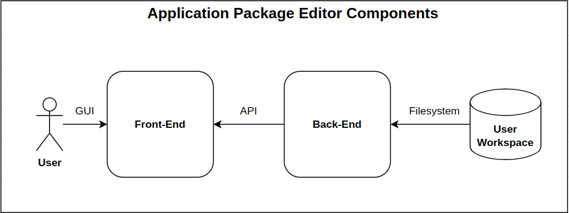
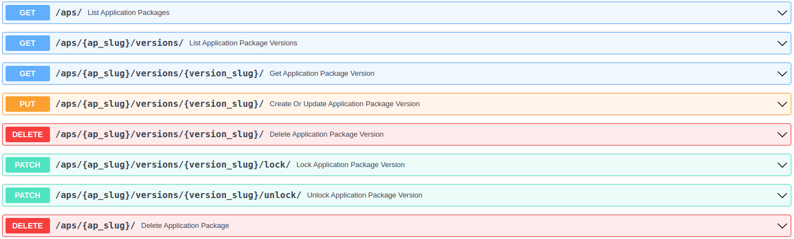

# Architectural Design

## Introduction
The Application Package Editor has 2 main building block which are the Front-end and Back-end as shown in 
the *Components Overview* figure. The Front-end manages the users interactions with the editor while 
the backend is responsible for managing the Application Packages of the user in its Workspace. The Front-End 
communicates with the Back-End though the API that is exposed by the later, this API allows management 
(Creation, Update and Deletion) of the Application Package Versions that are present in the user Workspace.

*
Components Overview
* 

## Front-End
As mentioned above, the Front-End is responsible for managing the user interaction with the editor. Thus, it 
provides a Graphical User Interface which:

  - Is implemented in a Form based way using VueJS and bootstrap.
  - Allows uploading / downloading of Application Packages on user local system.
  - Allows the management of the user Application Packages that are present in the user Workspace. In order to achieve 
    this, it communicates with the Back-End in order to open/lock/save/delete Application Packages and their versions.

## Back-End
The Band-end is, on the other hand, responsible for the management the user workspace. It is implemented using the 
FastAPI library and expose an API to manage the Application Packages of the user Workspace. 

  - It can be deployed as an ApplicationHub App with a configuration (from Jannes).
  - A startup script is used to retrieve the user credentials from a file (configmap if in k8s) in order to mount the 
    user workspace as filesystem volume on `/app/backend/files`.
  - If no user credentials are available, then nothing is mounted which allow testing of the editor outside EOEPCA 
    ApplicationHub.
  - It exposes the following API endpoints which are used by the Front-End to interact with the user workspace:
    

*
API Endpoints
* 
